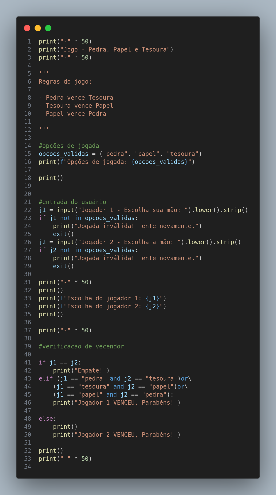

# 🪨📄✂️ Pedra, Papel e Tesoura

Um clássico e divertido jogo de **Pedra, Papel e Tesoura** (Jokenpô) desenvolvido totalmente em Python.

## 🚀 Funcionalidades

* **Jogabilidade Rápida:** Partidas dinâmicas, com regras claras.
* **Interface via Terminal:** Interação baseada em texto simples e amigável.

## 📋 Pré-requisitos

Para rodar este jogo, você só precisa ter o Python instalado na sua máquina:
* [Python 3](https://www.python.org/downloads/)

## 🔧 Como executar e jogar

Siga os passos abaixo para rodar o jogo localmente:

1. **Clone este repositório:**
   ```bash
   git clone [https://github.com/jefferson-rtt/pedra_papel_tesoura.git](https://github.com/jefferson-rtt/pedra_papel_tesoura.git)

## Demonstração do código

